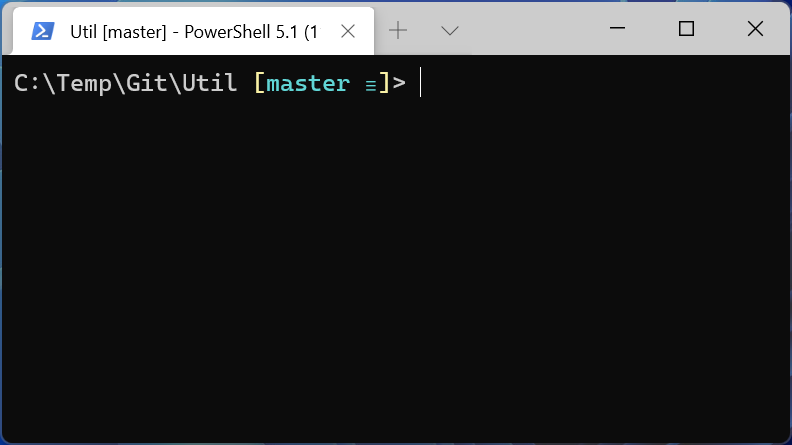
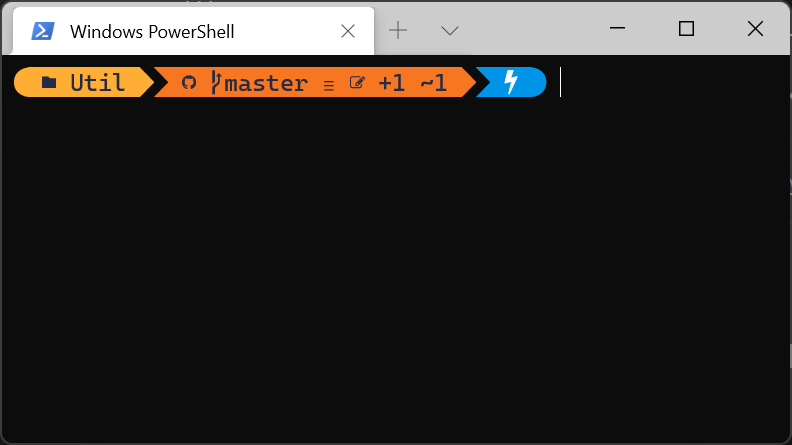

# Git Setup

Install posh-git and oh-my-posh. See also: https://docs.microsoft.com/en-us/windows/terminal/tutorials/custom-prompt-setup

## Install posh-git

Enables git tab completion.

```
Install-Module posh-git -Scope CurrentUser
Import-Module posh-git
notepad $PROFILE # Opens file PowerShell_profile.ps1
```
File: Microsoft.PowerShell_profile.ps1
```
Import-Module posh-git
```

## Install oh-my-posh

```
Install-Module oh-my-posh -Scope CurrentUser
Get-PoshThemes # Close and open terminal. Browse available themes
notepad $PROFILE # Opens file PowerShell_profile.ps1
```

File: Microsoft.PowerShell_profile.ps1
```
Import-Module posh-git # Can be omitted if oh-my-posh is used.
Import-Module oh-my-posh
Set-PoshPrompt -Theme powerlevel10k_rainbow # paradox
```

Install all fonts: https://www.nerdfonts.com/font-downloads (Download Caskaydia Cove Nerd Font)

Change font on Windows Terminal settings (opens settings.json)

```json
{
    // Make changes here to the powershell.exe profile.
    "guid": "{61c54bbd-c2c6-5271-96e7-009a87ff44bf}",
    "name": "Windows PowerShell",
    "commandline": "powershell.exe",
    "hidden": false,
    "startingDirectory": "C:/Temp/Git/",
    "fontFace": "CaskaydiaCove NF"
},
```

# GitHub Change Commit Author

Set Notepad as default git text editor
```
git config core.editor notepad
```
Start rewriting history like changing author or delete a commit.

**Important:** commit hash should be one BEFORE the one to change!
```
git rebase -i -p <commit> ### Only if <commit> is not latest commit
```

Notepad opens with a list of commits. Overwrite "pick" with "edit" for the commit you want to change the author.

```
git commit --amend --author "Author Name <email>"
git rebase --continue ### Only if <commit> is not latest commit
git push -f
```

Get current hash

```
git rev-parse --short HEAD
```
