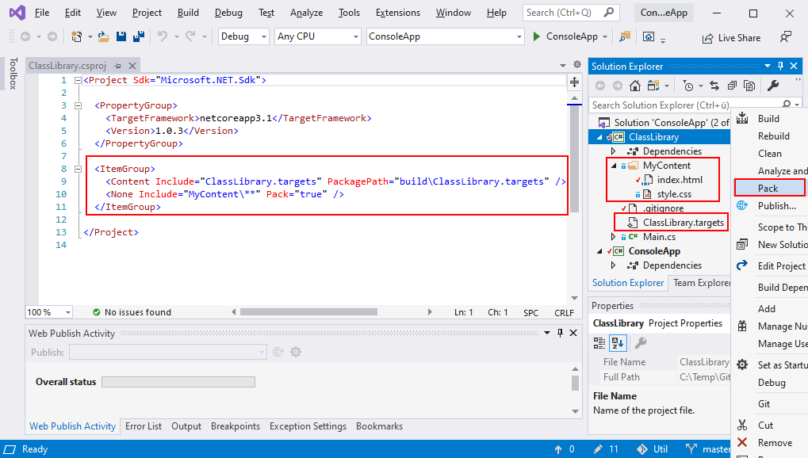
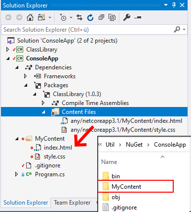

# Add and Consume Content Files (&ast;.html; &ast;.css) with NuGet in .NET Core
With NuGet it is possible to package and distribute content files similar to npm package manager. The following steps show how to add and consume a content folder.

In the (&ast;.csproj) add the following lines of code. It adds MyContent folder to the class library package. Then create the package by running Pack.

```xml
<ItemGroup>
  <None Include="MyContent\**" Pack="true" />
  <Content Include="ClassLibrary.targets" PackagePath="build\ClassLibrary.targets" />
</ItemGroup>
```

Add a new file ClassLibrary.targets. It defines where to extract MyContent folder in the consuming application.

```xml
<Project xmlns="http://schemas.microsoft.com/developer/msbuild/2003">
    <ItemGroup>
        <SourceScriptFiles Include="$(MSBuildThisFileDirectory)..\content\**" />
    </ItemGroup>
    <Target Name="CopyScriptsToProject" BeforeTargets="Build">
        <Copy SourceFiles="@(SourceScriptFiles)" DestinationFolder="$(ProjectDir)MyContent\" />
    </Target>
</Project>
```



## How does NuGet internally store files?
To verify files are packet into NuGet as expected rename any (&ast;.nupkg) file to (&ast;.nupkg.zip) and open it.


## Add and Build Package in Consuming Application
In the consuming application add the (&ast;.nupkg) file and build it.


