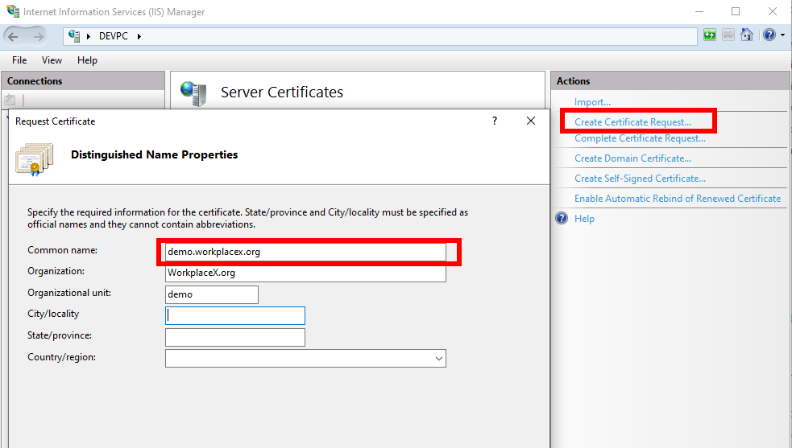
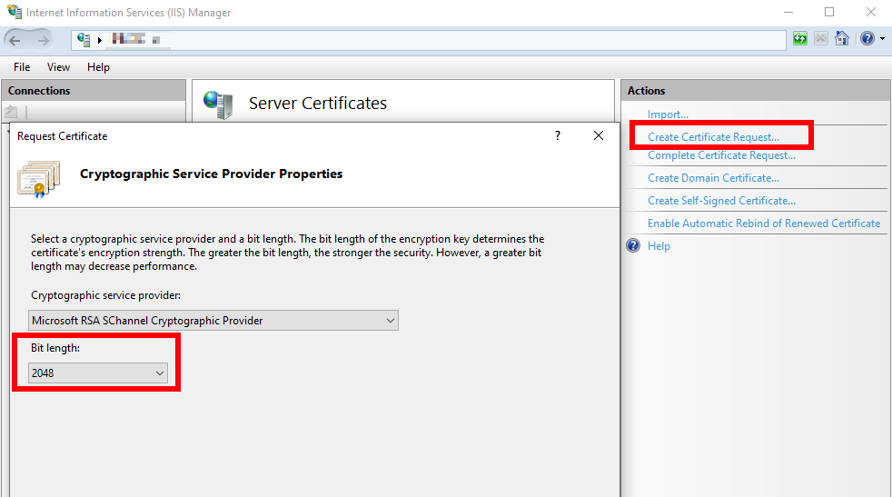
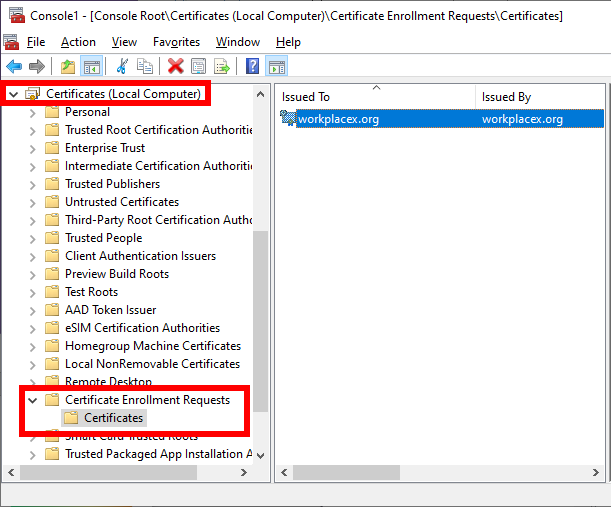
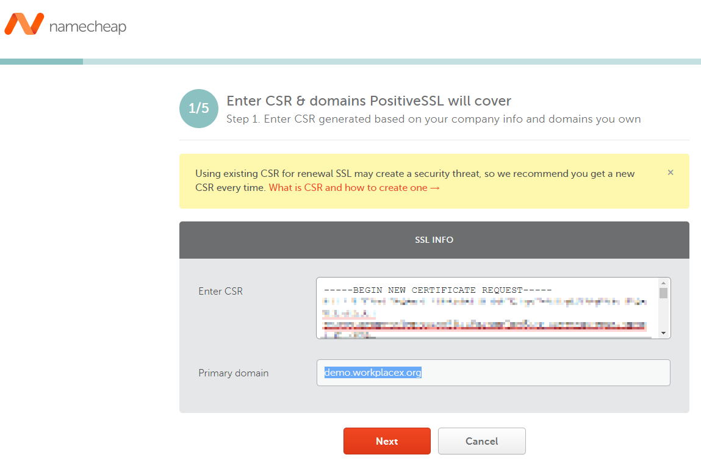
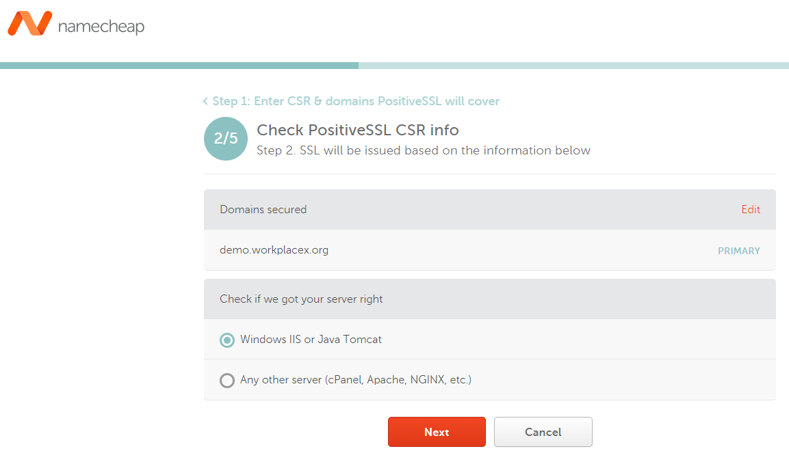
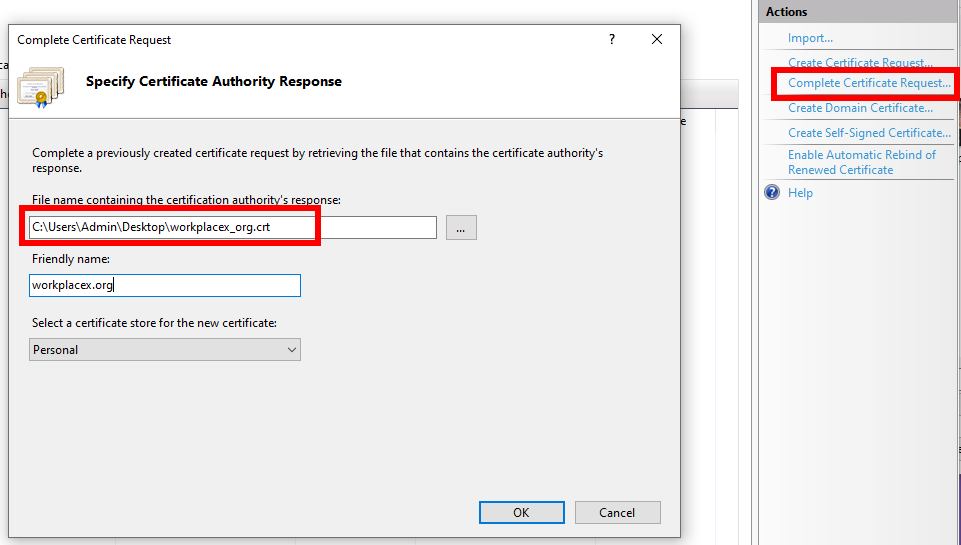
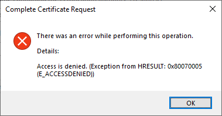
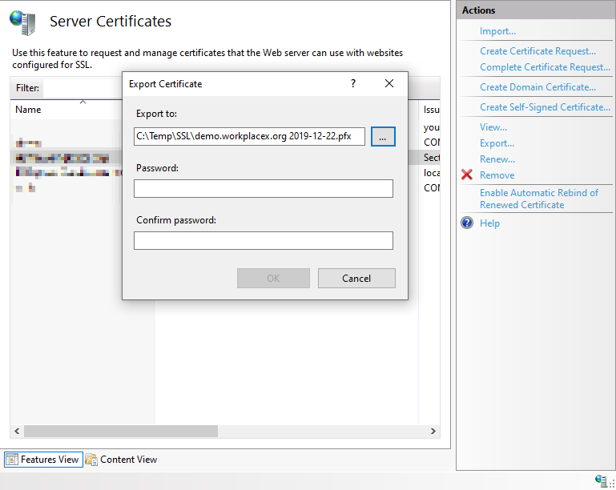

# Install SSL
Install SSL from Namecheap with IIS on Azure

## Create Certificate Request with IIS

## Bit Length

## Location of Certificate Request
For debug only. Contains request private key

Start > run > mmc > File > Add/Remove Snap-in... > Certificates > Computer account

## Domain Control Validation
Use DCV Method: Email

## Namecheap

## Complete Certificate Request
Both file types (*.cer) or (*.crt) can be imported!

## Access Denied Error
Access Denied. (Exception from HRESULT: 0x80070005 (E_ACCESSDENIED))
Happens if certificate is already installed. Remove all certificates from IIS and try again.

## Export to pxf file

